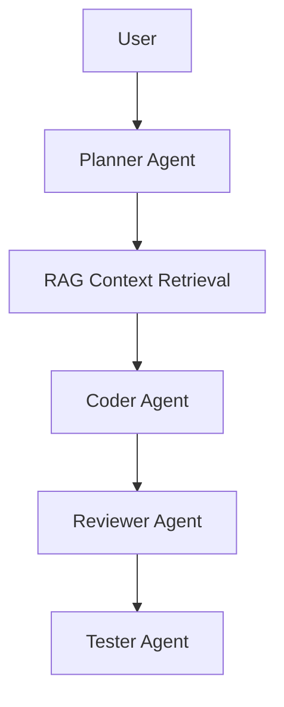

# AI Dev Agent

一个多 Agent 协作的软件研发 Agent。

## 功能

- Planner Agent：需求拆解
- Coder Agent：代码生成
- Reviewer Agent：代码审查
- Tester Agent：测试生成与执行
- RAG Memory：上下文检索
- LangGraph 工作流编排

## 架构图



## 启动

```bash
pip install -r requirements.txt
cp .env.example .env
uvicorn app.api.main:app --reload
```

## API

POST /run

```json
{
  "task": "实现一个 FastAPI 登录接口"
}
```